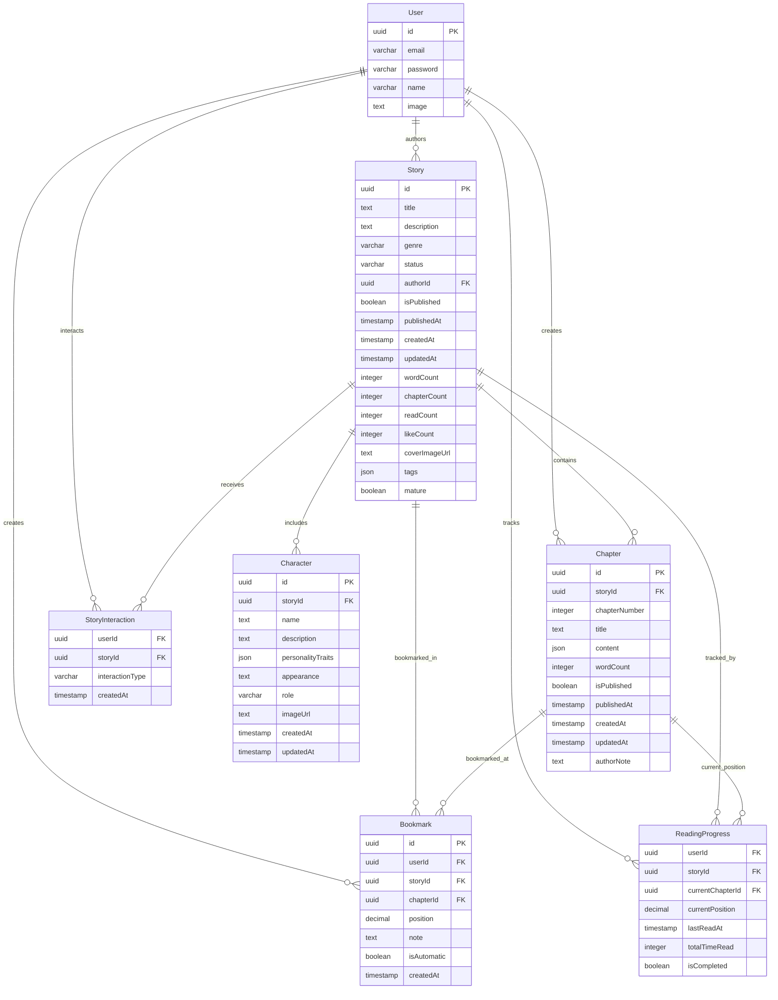

# Database Schema: Books/Novels Architecture

## Overview

The Fictures platform implements a comprehensive book/novel database schema that supports the relationship: **User → Books(Stories) → Chapters**. The schema is designed to handle web novel publishing, reading experiences, and community engagement.

## Core Entity Relationships



## Core Tables Description

### 1. User Table
**Purpose**: Stores user authentication and profile information
- **Primary Key**: `id` (UUID)
- **Key Fields**: `email`, `name`, `image`
- **Relationships**: One-to-many with Story, Chapter, and all user-specific tables

### 2. Story Table (Books/Novels)
**Purpose**: Main entity representing books, novels, or stories
- **Primary Key**: `id` (UUID)
- **Foreign Keys**: 
  - `authorId` → User.id (author relationship)
- **Key Fields**:
  - `title`, `description`: Basic story information
  - `genre`: Story categorization
  - `status`: draft, ongoing, completed, hiatus
  - `isPublished`, `publishedAt`: Publication state
  - `wordCount`, `chapterCount`: Metrics
  - `readCount`, `likeCount`: Engagement metrics
  - `coverImageUrl`: Visual representation
  - `tags`: JSON array for flexible tagging
  - `mature`: Content rating flag

### 3. Chapter Table
**Purpose**: Individual chapters within stories
- **Primary Key**: `id` (UUID)
- **Foreign Keys**: 
  - `storyId` → Story.id (parent story)
- **Key Fields**:
  - `chapterNumber`: Sequential ordering
  - `title`: Chapter title
  - `content`: JSON content (supports rich text)
  - `wordCount`: Chapter metrics
  - `isPublished`, `publishedAt`: Publication state
  - `authorNote`: Additional author commentary

### 4. Character Table
**Purpose**: Character management within stories
- **Primary Key**: `id` (UUID)
- **Foreign Keys**: 
  - `storyId` → Story.id (story association)
- **Key Fields**:
  - `name`, `description`: Basic character info
  - `personalityTraits`: JSON array of traits
  - `appearance`: Physical description
  - `role`: protagonist, antagonist, supporting, minor
  - `imageUrl`: Character visualization

## Reading Experience Tables

### 5. ReadingProgress Table
**Purpose**: Track user reading progress across stories
- **Composite Primary Key**: `userId`, `storyId`
- **Foreign Keys**: 
  - `userId` → User.id
  - `storyId` → Story.id  
  - `currentChapterId` → Chapter.id (nullable for flexibility)
- **Key Fields**:
  - `currentChapterId`: Last read chapter (UUID foreign key)
  - `currentPosition`: Position within chapter (scroll/page)
  - `lastReadAt`: Timestamp of last reading session
  - `totalTimeRead`: Accumulated reading time
  - `isCompleted`: Story completion flag

### 6. StoryInteraction Table
**Purpose**: User interactions with stories (likes, bookmarks, follows)
- **Composite Primary Key**: `userId`, `storyId`, `interactionType`
- **Interaction Types**: like, bookmark, follow
- **Usage**: Enables engagement metrics and user libraries

### 7. Bookmark Table
**Purpose**: User bookmarks within stories
- **Primary Key**: `id` (UUID)
- **Foreign Keys**: 
  - `userId` → User.id
  - `storyId` → Story.id
  - `chapterId` → Chapter.id (ensures referential integrity)
- **Key Fields**:
  - `chapterId`: Chapter location (UUID foreign key)
  - `position`: Precise position within chapter
  - `note`: Optional user note
  - `isAutomatic`: System vs user-created bookmark

## Enhanced Reading Experience (Phase 2)

The schema includes advanced reading features:

### UserPreferences Table
- **Purpose**: Personalized reading settings
- **Features**: Theme, typography, accessibility, layout preferences
- **Fields**: `readingTheme`, `fontSize`, `fontFamily`, `dyslexiaFriendly`, etc.

### ReadingCollection & ReadingList Tables
- **Purpose**: User-curated story collections
- **Difference**: Collections are categorized groups, Lists are ordered sequences
- **Features**: Public/private visibility, flexible story organization

### ReadingStatistics & ReadingAchievement Tables
- **Purpose**: Gamification and progress tracking
- **Features**: Reading streaks, words per minute, completion rates
- **Achievement Types**: first-story, speed-reader, genre-explorer, etc.

### OfflineStory Table
- **Purpose**: Offline reading capability
- **Features**: Downloaded chapter tracking, sync management, storage metrics

## Community Features (Phase 3)

The schema extends to support community engagement:

### Forum System
- `ForumCategory`, `ForumThread`, `ForumPost`, `ForumModeration`
- Hierarchical discussion structure with moderation capabilities

### Group System
- `Group`, `GroupMember`, `GroupActivity`, `GroupInvitation`
- User-created communities with role-based permissions

### Contest System
- `Contest`, `ContestSubmission`, `ContestVote`
- Writing competitions with judging and voting mechanisms

### Collaboration Tools
- `BetaReader`, `CoAuthor`, `Workshop`
- Professional writing collaboration and education features

## Data Types and Constraints

### UUID Primary Keys
- All primary keys use UUID for distributed system compatibility
- Ensures unique identification across environments

### JSON Fields
- `Story.tags`: Flexible tagging system
- `Chapter.content`: Rich text content with formatting
- `Character.personalityTraits`: Structured character data
- Various metadata fields for extensibility

### Status Enums
- `Story.status`: draft, ongoing, completed, hiatus
- `Character.role`: protagonist, antagonist, supporting, minor
- Ensures data consistency and enables filtered queries

### Timestamps
- All tables include `createdAt` and `updatedAt` where applicable
- Supports audit trails and temporal queries

## Query Optimization

### Indexes (Recommended)
```sql
-- Story discovery and filtering
CREATE INDEX idx_story_author_published ON Story(authorId, isPublished, publishedAt);
CREATE INDEX idx_story_genre_status ON Story(genre, status);
CREATE INDEX idx_story_tags ON Story USING gin(tags);

-- Chapter ordering and access
CREATE INDEX idx_chapter_story_number ON Chapter(storyId, chapterNumber);
CREATE INDEX idx_chapter_published ON Chapter(storyId, isPublished, publishedAt);

-- Reading progress tracking
CREATE INDEX idx_reading_progress_user ON ReadingProgress(userId, lastReadAt);
CREATE INDEX idx_reading_progress_story ON ReadingProgress(storyId, isCompleted);

-- User interactions
CREATE INDEX idx_story_interaction_user ON StoryInteraction(userId, interactionType);
CREATE INDEX idx_story_interaction_story ON StoryInteraction(storyId, interactionType);
```

### Common Query Patterns
1. **User's authored stories**: Query Story by authorId
2. **Story chapters in order**: Query Chapter by storyId, order by chapterNumber
3. **User's reading list**: Query StoryInteraction with interactionType='bookmark'
4. **Reading progress**: Query ReadingProgress by userId for dashboard
5. **Story discovery**: Complex filtering by genre, status, tags, ratings

## Recent Schema Improvements (Migration 0011)

**Referential Integrity Enhancement**: Replaced integer-based chapter references with UUID foreign keys:

### Before (Problematic Design):
```sql
-- ReadingProgress table
currentChapterNumber integer NOT NULL DEFAULT 1

-- Bookmark table  
chapterNumber integer NOT NULL
```

### After (Improved Design):
```sql
-- ReadingProgress table
currentChapterId uuid REFERENCES Chapter(id)

-- Bookmark table
chapterId uuid NOT NULL REFERENCES Chapter(id)
```

### Benefits of This Migration:
1. **Referential Integrity**: Foreign key constraints ensure chapter references are valid
2. **Query Performance**: Direct UUID joins instead of composite (storyId, chapterNumber) lookups
3. **Flexibility**: Supports non-sequential chapter numbering and chapter reordering
4. **Data Consistency**: Prevents orphaned references when chapters are deleted
5. **Simpler Queries**: Single UUID join instead of multi-column WHERE conditions

### Migration Strategy:
- **Backward Compatibility**: APIs still accept `chapterNumber` parameters  
- **Automatic Conversion**: Query functions convert chapter numbers to chapter IDs
- **Data Migration**: Existing data converted using story + chapter number lookup
- **Graceful Handling**: NULL `currentChapterId` allowed for flexibility

## Migration Considerations

The schema has been enhanced for better referential integrity. Key considerations:

1. **Performance**: Add indexes for common query patterns  
2. **Analytics**: Consider read-optimized views for reporting
3. **Versioning**: Chapter content versioning for editing history
4. **Caching**: Denormalized fields for frequently accessed aggregations

## Schema Validation

The schema includes appropriate constraints:
- Foreign key relationships maintain referential integrity
- NOT NULL constraints on required fields
- Default values for optional fields
- Enum constraints for status fields
- Unique constraints where appropriate (slugs, emails)

## Future Extensions

The schema is designed for extensibility:
- JSON fields allow for feature evolution without schema changes
- Modular table design supports feature toggles
- UUID keys support distributed architecture
- Timestamp tracking enables audit capabilities

This schema provides a robust foundation for a web novel platform with room for growth and feature enhancement while maintaining data integrity and query performance.