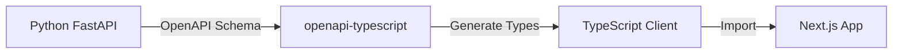

# Monorepo Architecture

This document describes the monorepo structure for the Fictures project, which includes both a Next.js web application and a Python FastAPI AI server.

## Overview

The project uses **pnpm workspaces** to manage a polyglot monorepo with:
- **Next.js 15** web application (TypeScript)
- **FastAPI** AI model server (Python)
- **Type-safe API client** (TypeScript)

## Directory Structure

```
Fictures/
├── apps/
│   ├── web/                          # Next.js application
│   │   ├── src/                      # Source code
│   │   │   ├── app/                  # Next.js App Router
│   │   │   ├── components/           # React components
│   │   │   └── lib/                  # Utilities and services
│   │   ├── drizzle/                  # Database schema and migrations
│   │   ├── scripts/                  # Build and utility scripts
│   │   ├── tests/                    # E2E tests (Playwright)
│   │   ├── __tests__/                # Unit tests (Jest)
│   │   ├── package.json              # Next.js dependencies
│   │   ├── next.config.mjs           # Next.js configuration
│   │   ├── tsconfig.json             # TypeScript configuration
│   │   └── .env.local                # Environment variables
│   │
│   └── ai-server/                    # Python FastAPI server
│       ├── src/
│       │   ├── main.py               # FastAPI application
│       │   ├── routes/               # API route handlers
│       │   │   ├── text_generation.py
│       │   │   └── image_generation.py
│       │   ├── schemas/              # Pydantic models
│       │   │   ├── text.py
│       │   │   └── image.py
│       │   ├── services/             # Business logic
│       │   └── models/               # AI model loading
│       ├── models/                   # Local AI model weights (gitignored)
│       ├── venv/                     # Python virtual environment (gitignored)
│       ├── requirements.txt          # Production dependencies
│       ├── requirements-dev.txt      # Development dependencies
│       └── package.json              # Scripts for pnpm integration
│
├── packages/
│   └── api-client/                   # TypeScript API client
│       ├── src/
│       │   ├── index.ts              # Main client implementation
│       │   └── generated/            # Auto-generated types (gitignored)
│       ├── package.json
│       └── tsconfig.json
│
├── pnpm-workspace.yaml               # Workspace configuration
├── package.json                      # Root orchestration scripts
├── CLAUDE.md                         # Project guidelines
├── MONOREPO-SETUP.md                 # Migration guide
└── docs/
    └── monorepo-architecture.md      # This file
```

## Workspace Configuration

### pnpm-workspace.yaml

```yaml
packages:
  - 'apps/*'
  - 'packages/*'
```

This tells pnpm to treat all directories under `apps/` and `packages/` as workspace packages.

### Root package.json

The root `package.json` orchestrates commands across workspaces:

```json
{
  "scripts": {
    "dev": "pnpm --parallel --filter web --filter ai-server dev",
    "dev:web": "pnpm --filter web dev",
    "dev:ai": "pnpm --filter ai-server dev",
    "build": "pnpm --filter web build"
  }
}
```

## Package References

### Internal Package Dependencies

Packages can reference each other using workspace protocol:

```json
{
  "dependencies": {
    "@fictures/api-client": "workspace:*"
  }
}
```

### Package Naming Convention

- **@fictures/web** - Next.js web application
- **@fictures/ai-server** - Python FastAPI server
- **@fictures/api-client** - TypeScript API client

## Development Workflow

### 1. Running Development Servers

```bash
# Run both servers in parallel
pnpm dev

# Run individually
pnpm dev:web    # Next.js on http://localhost:3000
pnpm dev:ai     # FastAPI on http://localhost:8000
```

### 2. Type-Safe API Integration



**Steps:**
1. Start AI server: `pnpm dev:ai`
2. Generate types: `cd packages/api-client && pnpm generate`
3. Use in Next.js: `import { aiClient } from '@fictures/api-client'`

### 3. Making Changes

**Python API Changes:**
1. Edit files in `apps/ai-server/src/`
2. FastAPI auto-reloads with `--reload` flag
3. Regenerate TypeScript types if schema changed
4. TypeScript errors will catch API contract violations

**Next.js Changes:**
1. Edit files in `apps/web/src/`
2. Next.js auto-reloads with Fast Refresh
3. Use `@fictures/api-client` for AI server calls

## Key Features

### 1. Shared Development Experience

- **Single `pnpm install`** installs all dependencies
- **Parallel execution** with `pnpm --parallel`
- **Consistent tooling** across TypeScript and Python
- **Unified git repository** for easier code review

### 2. Type Safety Between Languages

- **Pydantic models** in Python define API contracts
- **OpenAPI schema** generated automatically by FastAPI
- **TypeScript types** generated from OpenAPI schema
- **Compile-time errors** catch API mismatches

### 3. Independent Deployment

Each app can be deployed separately:
- **Next.js** → Vercel, Netlify, or any Node.js host
- **Python AI Server** → Railway, Fly.io, Modal Labs, or GPU cloud

### 4. Workspace Commands

```bash
# Run command in specific workspace
pnpm --filter web build
pnpm --filter ai-server install

# Run command in all workspaces
pnpm -r build    # recursive
pnpm -r test     # all tests

# Add dependency to specific workspace
pnpm --filter web add axios
pnpm --filter ai-server add numpy  # Note: Python uses pip, not pnpm
```

## Environment Variables

### apps/web/.env.local

```bash
# Database
DATABASE_URL=...
DATABASE_URL_UNPOOLED=...

# Authentication
AUTH_SECRET=...
GOOGLE_CLIENT_ID=...
GOOGLE_CLIENT_SECRET=...

# AI Integration
AI_GATEWAY_API_KEY=...
GOOGLE_GENERATIVE_AI_API_KEY=...

# Storage
BLOB_READ_WRITE_TOKEN=...
REDIS_URL=...

# Local AI Server (new)
AI_SERVER_URL=http://localhost:8000  # For local development
```

### apps/ai-server/.env

```bash
# Model paths
TEXT_MODEL_PATH=models/text/llama-3.2-3b
IMAGE_MODEL_PATH=models/images/stable-diffusion-xl

# Performance
CUDA_VISIBLE_DEVICES=0
MODEL_CACHE_DIR=~/.cache/huggingface

# API settings
API_PORT=8000
API_HOST=0.0.0.0
CORS_ORIGINS=http://localhost:3000,http://127.0.0.1:3000
```

## API Integration Examples

### In Next.js API Routes (Server-Side)

```typescript
// apps/web/src/app/api/ai/generate/route.ts
import { aiClient } from '@fictures/api-client';
import { auth } from '@/lib/auth';

export async function POST(request: Request) {
  const session = await auth();
  if (!session) {
    return Response.json({ error: 'Unauthorized' }, { status: 401 });
  }

  const { prompt } = await request.json();

  try {
    const result = await aiClient.generateText({
      prompt,
      max_tokens: 2048,
      temperature: 0.8,
    });

    return Response.json(result);
  } catch (error) {
    console.error('AI generation failed:', error);
    return Response.json(
      { error: 'Generation failed' },
      { status: 500 }
    );
  }
}
```

### In React Components (Client-Side)

```typescript
// apps/web/src/components/AIGenerator.tsx
'use client';

import { useState } from 'react';
import { aiClient } from '@fictures/api-client';

export function AIGenerator() {
  const [prompt, setPrompt] = useState('');
  const [result, setResult] = useState('');
  const [loading, setLoading] = useState(false);

  const generate = async () => {
    setLoading(true);
    try {
      const response = await aiClient.generateText({
        prompt,
        max_tokens: 1024,
        temperature: 0.7,
      });
      setResult(response.text);
    } catch (error) {
      console.error('Generation failed:', error);
    } finally {
      setLoading(false);
    }
  };

  return (
    <div>
      <textarea
        value={prompt}
        onChange={(e) => setPrompt(e.target.value)}
        placeholder="Enter your prompt..."
      />
      <button onClick={generate} disabled={loading}>
        {loading ? 'Generating...' : 'Generate'}
      </button>
      {result && <pre>{result}</pre>}
    </div>
  );
}
```

## Deployment Strategy

### Development

```bash
# Local development with both servers
pnpm dev

# Access:
# - Next.js: http://localhost:3000
# - FastAPI: http://localhost:8000
# - API Docs: http://localhost:8000/docs
```

### Production

**Option 1: Separate Deployments (Recommended)**
- **Next.js** → Vercel (automatic from `apps/web`)
- **Python AI Server** → Railway/Fly.io/Modal Labs
- Update `AI_SERVER_URL` in Next.js environment

**Option 2: Collocated Deployment**
- Deploy both to same server (e.g., Railway with Dockerfile)
- Use reverse proxy (nginx) to route requests

## Benefits of This Architecture

### ✅ Type Safety
- Python Pydantic models → OpenAPI schema → TypeScript types
- Catch API contract violations at compile time

### ✅ Developer Experience
- Single repository for easier code review
- Shared git history and version control
- Consistent development workflow

### ✅ Independent Scaling
- Scale Next.js and AI server independently
- AI server can use GPU instances
- Next.js can use serverless/edge

### ✅ Local AI Models
- Run models locally without cloud API costs
- Full control over model versions
- Privacy: data never leaves your infrastructure

### ✅ Flexibility
- Easy to add more apps/packages
- Can deploy together or separately
- Shared packages between apps

## Migration from Single Repo

If migrating from single Next.js repo:
1. Review `MONOREPO-SETUP.md`
2. Run `scripts/migrate-to-monorepo.sh`
3. Install dependencies: `pnpm install`
4. Test: `pnpm dev`

## Troubleshooting

### pnpm workspace issues

```bash
# Clear cache and reinstall
pnpm store prune
rm -rf node_modules pnpm-lock.yaml
pnpm install
```

### Python virtual environment

```bash
cd apps/ai-server
rm -rf venv
python -m venv venv
source venv/bin/activate
pip install -r requirements.txt
```

### Type generation fails

```bash
# Ensure AI server is running
pnpm dev:ai

# Check health
curl http://localhost:8000/health

# Regenerate types
cd packages/api-client
pnpm generate
```

## References

- **Setup Guide**: `MONOREPO-SETUP.md`
- **AI Server README**: `apps/ai-server/README.md`
- **API Client README**: `packages/api-client/README.md`
- **Project Guidelines**: `CLAUDE.md`
